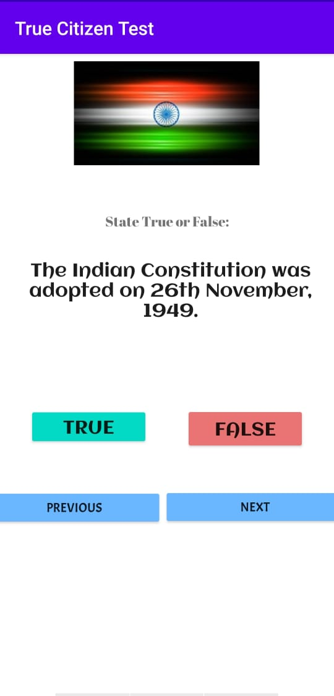
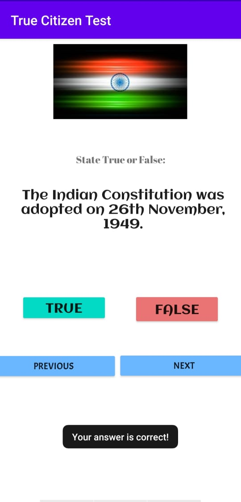
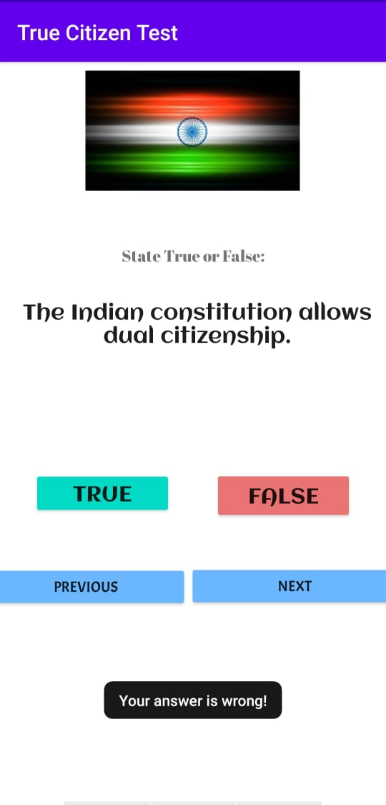

## TrueCitizenTest
 - It is a quiz app, made using Java in Android Studio.
 - It has two options for each question : True and False. 
 - The Next button brings the next question on the screen, and the Previous button brings the previous question.
 - A prompt tells whether or not the user's answer was correct.
 
   

